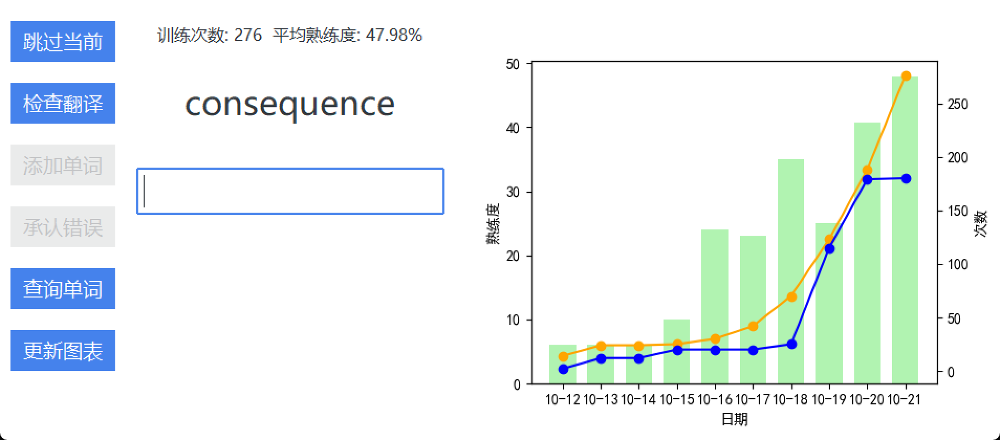

# 单词测试应用


欢迎来到我的单词测试应用！这个应用可以帮助你学习和测试单词的翻译，以提高你的语言技能。  

## 作者

- **名字：** EveSunMaple
- **邮箱：** [evesunmaple@outlook.com](mailto:evesunmaple@outlook.com)
- **博客：** [SaroProck](https://www.saroprock.com)  

## 项目简介

这个项目是一个用Python和Tkinter制作的单词测试应用。你可以加载单词列表、测试单词的翻译、更新单词的熟练度，以及保存你的学习进度。此外，我们还提供了一个可视化的折线图来跟踪你的学习进展。



## 功能
  
- 从文件加载单词列表
- 测试单词的翻译并跟踪熟练度
- 添加和保存新的翻译
- 可视化熟练度折线图
- 统计学习进度  

## 如何使用

1. 安装必要的依赖项：

```bash
pip install ttkbootstrap
```

2. 导入你的单词列表与统计数据：

    - 创建一个名为 word_list.md 的文本文件，其中包含你的单词列表。每行应该按以下格式： | 单词 | 翻译 | 熟练度 |

    下面是一个示例：

    ```Markdown
    | 单词 | 翻译 | 熟练度 |
    | :---: | :---: | :---: |
    | abandon | 放弃 | 0.1900 |
    | abstract | 抽象的，抽取，概要 | 0.1719 |
    | abundant | 广泛的 | 0.1571 |
    | academic | 学者，纯理论的，学术的，教授 | 0.7789 |
    | accident | 事故 | 0.1900 |
    | accompany | 陪伴 | 0.3439 |
    | accumulate | 积累 | 0.3439 |
    ```

    - 创建一个名为 training_stats.md 的文本文件，格式为：| 开始训练时间 | 最后训练时间 | 总训练次数 | 平均熟练度 |
    
    下面是一个示例：

    ```Markdown
    | 开始训练时间 | 最后训练时间 | 总训练次数 | 平均熟练度 |
    | :---: | :---: | :---: | :---: |
    | 2023-10-20 17:26:31.446832 | 2023-10-20 18:05:45.707340 | 259 | 27.81 |
    ```

3. 使用应用程序进行学习和测试单词。

## 问题和反馈

如果你发现了bug或有任何建议，请在GitHub上的 Issues 中提出问题。